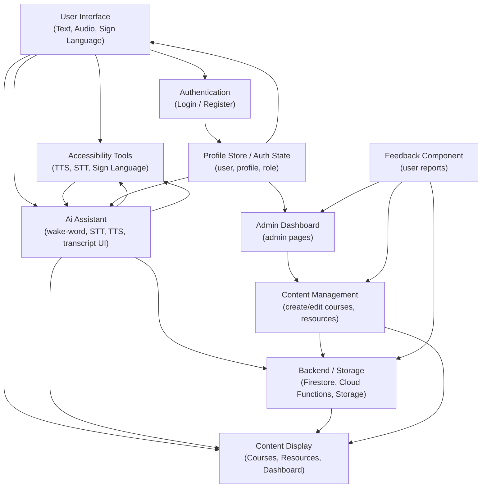

# SenseAid — Architecture

This repo contains the SenseAid application. Below is the high-level architecture diagram (SVG) and the Mermaid source used to create the diagram for quick reference.

## Diagram

## Mermaid source

## Mapping (boxes -> files)

- User Interface
  - `src/app/*`, `src/components/Layout/*`, `src/components/UI/*`
- Accessibility Tools
  - `src/components/UI/AiAssistant.tsx`, `src/components/UI/ScreenReader.tsx`, `src/components/UI/VisualAlert.tsx`
- Authentication
  - `src/store/authStore.ts`, `src/app/login/page.tsx`, `src/app/signup/page.tsx`, `src/app/admin/login/page.tsx`
- Profile Store / Auth State
  - `src/store/profileStore.ts`, `src/store/authStore.ts`
- Ai Assistant
  - `src/components/UI/AiAssistant.tsx`, `src/lib/gemini.ts`
- Admin Dashboard / Content Management
  - `src/app/admin/*`
- Feedback Component
  - `src/app/*` (search for feedback forms), `api/*` if present
- Backend / Storage
  - `functions/`, `firestore.rules`, `src/lib/firebase.ts`

## Notes

- The included SVG (`assets/architecture.svg`) is vector and suitable for high-resolution printing or embedding.
- If you'd like, I can also export a PNG raster image at specific DPI and add it to the repo — tell me the desired pixel dimensions.
